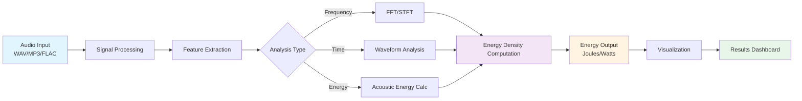

<div align="center">
  


[](https://github.com/JaclynCodes/Symphonic-Joules/actions/workflows/blank.yml)
[](https://www.python.org/downloads/)
[](https://opensource.org/licenses/MIT)
[](https://github.com/psf/black)
[](tests/)
[](#-roadmap)

</div>

---

## 🔬 Scientific North Star

At the heart of Symphonic-Joules lies the **acoustic energy density** equation, which governs how sound carries energy through space:

<div align="center">

### **w = p² / (2ρc²) + ρv² / 2**

Where:
- **w** = acoustic energy density (J/m³)
- **p** = sound pressure (Pa)
- **ρ** = medium density (kg/m³)
- **c** = speed of sound (m/s)
- **v** = particle velocity (m/s)

*This fundamental relationship bridges acoustics and energy, guiding our computational approach.*

</div>

---

## 🎵 Mission

A project that harmonizes the worlds of sound and energy through innovative computational approaches, providing tools and insights that bridge the gap between acoustics and physics.

---

## 🌊 Data Flow Architecture



*This diagram illustrates the transformation pipeline from raw audio signals to quantified energy measurements.*

---

## 📋 Table of Contents

- [Scientific North Star](#-scientific-north-star)
- [Mission](#-mission)
- [Data Flow Architecture](#-data-flow-architecture)
- [Overview](#-overview)
- [Interface-First Design](#-interface-first-design)
- [Features](#-features)
- [Quick Start](#-quick-start)
- [Usage Examples](#-usage-examples)
- [Project Structure](#-project-structure)
- [Testing Philosophy: Documentation-as-Code](#-testing-philosophy-documentation-as-code)
- [Contributing](#-contributing)
- [Roadmap](#-roadmap)
- [Scientific Background](#-scientific-background)
- [Documentation](#-documentation)
- [Community](#-community)
- [License](#-license)

---

## 🎵 Overview

Symphonic-Joules is an open-source project that explores the intersection of audio processing and energy calculations. Whether you're working with sound waves, musical compositions, or energy transformations, this project aims to provide tools and insights that bridge the gap between acoustics and physics.

**Mission**: To create an extensible, scientifically-grounded framework for analyzing the energetic properties of sound and the sonic properties of energy systems.

---

## 💻 Interface-First Design

Symphonic-Joules follows an **interface-first** philosophy, where API design drives implementation. Below is the intended API showcasing how users will interact with the framework:

### Core Interfaces

```python
from symphonic_joules import AudioSignal, EnergyCalculator

# Load and represent an audio signal
signal = AudioSignal.from_file("symphony.wav")

# Access signal properties
print(f"Duration: {signal.duration}s")
print(f"Sample Rate: {signal.sample_rate}Hz")
print(f"Channels: {signal.channels}")

# Calculate acoustic energy density
calculator = EnergyCalculator(
    medium_density=1.225,  # kg/m³ (air at 20°C)
    sound_speed=343.0      # m/s (air at 20°C)
)

# Compute energy metrics
energy_density = calculator.compute_energy_density(signal)
total_energy = calculator.compute_total_energy(signal)
power = calculator.compute_average_power(signal)

print(f"Energy Density: {energy_density:.6f} J/m³")
print(f"Total Energy: {total_energy:.6f} J")
print(f"Average Power: {power:.6f} W")

# Advanced: Frequency-domain energy analysis
freq_energy = calculator.energy_spectrum(signal)
freq_energy.plot(title="Energy Distribution by Frequency")
```

### Design Principles

1. **Explicit over Implicit**: Clear parameter names and units
2. **Type Safety**: Strong typing with validation
3. **Scientific Accuracy**: All calculations reference physics literature
4. **Composability**: Modular components that work together seamlessly
5. **Performance**: Efficient algorithms optimized for real-time processing

*This API is aspirational and drives our development roadmap.*

---

## ✨ Features

### Current (Phase 1: Foundation)

- 🏗️ **Solid Infrastructure**: Professional project structure following Python best practices
- 🎯 **Interface-First Design**: API designed before implementation for clarity
- 🔬 **Scientific Rigor**: Physics-based calculations with proper unit handling
- 🧪 **Documentation-as-Code**: Meta-tests that validate documentation accuracy
- 📊 **Comprehensive Testing**: 190+ tests across workflows, validation, and infrastructure
- 🔄 **CI/CD Pipeline**: Automated testing and quality checks
- 📚 **Rich Documentation**: Detailed guides for users and contributors
- ⚡ **Performance Focused**: Designed for efficient large-file processing

### Coming Soon (Phase 2: Analysis)

- 🎼 **Audio Processing**: WAV, MP3, FLAC file support with streaming
- 📈 **Frequency Analysis**: FFT, STFT, and spectral transformations
- ⚡ **Energy Calculations**: Acoustic energy density and power measurements
- 🔍 **Feature Extraction**: MFCCs, spectral features, and more

### Future (Phase 3: Visualization)

- 📊 **Data Visualization**: Interactive plots and energy heatmaps
- 💻 **CLI Tool**: `joule` command-line interface
- 🌐 **Web Dashboard**: Real-time energy monitoring
- 📤 **Export Tools**: JSON, CSV, and PDF report generation

---

## 🚀 Quick Start

### Prerequisites

- **Python 3.8 or higher** (Python 3.11 recommended for macOS users)
- **pip** (Python package installer)
- **git** (version control)

### Installation

```bash
# 1. Clone the repository
git clone https://github.com/JaclynCodes/Symphonic-Joules.git
cd Symphonic-Joules

# 2. Create and activate a virtual environment (recommended)
python -m venv venv

# On Windows:
venv\Scripts\activate

# On Unix/macOS:
source venv/bin/activate

# 3. Install the package in development mode
pip install -e .

# 4. Install development dependencies (optional, for contributors)
pip install -e ".[dev]"
```

### Verify Installation

```bash
# Run the test suite to verify installation
python -m pytest tests/ -v

# Check package version (note: Python package uses underscores, not hyphens)
python -c "import symphonic_joules; print(symphonic_joules.__version__)"
```

For detailed installation instructions, troubleshooting, and platform-specific guidance, see **[docs/installation-setup.md](docs/installation-setup.md)**.

## 💡 Usage Examples

### Python API

Currently, Symphonic-Joules provides a Python API for audio and energy computations. The package is designed to be imported and used programmatically.

**Note**: The Python package name uses underscores (`symphonic_joules`) following Python naming conventions, while the repository and project name use hyphens (`Symphonic-Joules`).

```python
# Import the package (note: use underscores in Python)
import symphonic_joules

# Check version
print(f"Symphonic-Joules v{symphonic_joules.__version__}")

# Future usage examples will include:
# - Loading and processing audio files
# - Computing energy transformations
# - Analyzing frequency domain properties
# - Visualizing acoustic and energetic data
```

### Planned CLI Interface

A command-line interface (`joule`) is planned for future releases to provide easy access to core functionality:

```bash
# Planned CLI commands (coming soon):
# joule process-audio <input.wav> --output <output.wav>
# joule analyze-energy <audio-file>
# joule list-filters
# joule convert --format mp3 <input>
```

For more examples and tutorials, see **[docs/examples/](docs/examples/)** and **[docs/getting-started.md](docs/getting-started.md)**.

---

## 🧪 Testing Philosophy: Documentation-as-Code

Symphonic-Joules employs a unique **Documentation-as-Code** approach where tests validate not just code functionality, but also documentation accuracy. This ensures our documentation never drifts from reality.

### The Validation Loop

```
Code Implementation → Documentation → Automated Tests → Validation
         ↑                                                  ↓
         └──────────────── Feedback Loop ─────────────────┘
```

### How It Works

Our test suite includes **meta-tests** that validate documentation itself:

```python
# From tests/test_readme_validation.py
class TestREADMEStructure:
    """Validates README has required sections"""
    
    def test_has_overview_section(self, readme_content):
        assert '## Overview' in readme_content
    
    def test_has_dependencies_section(self, readme_content):
        assert '## Dependencies' in readme_content

class TestTestCountAccuracy:
    """Ensures documented test counts match actual implementation"""
    
    def test_total_test_count_is_accurate(self, readme_content, actual_test_count):
        # Extracts test count from README and compares with actual
        documented_count = extract_test_count(readme_content)
        assert documented_count == actual_test_count
```

### Benefits

- ✅ **Always Current**: Documentation is validated on every CI run
- ✅ **Trustworthy**: Users can rely on examples and counts
- ✅ **Living Documentation**: Tests enforce documentation standards
- ✅ **Regression Prevention**: Changes that break docs fail tests

### Try It Yourself

```bash
# Run documentation validation tests
python -m pytest tests/test_readme_validation.py -v

# Run all tests including documentation checks
python -m pytest tests/ -v
```

*This testing philosophy ensures Symphonic-Joules maintains the highest standards of technical rigor and scientific accuracy.*

For comprehensive test documentation, see **[tests/README.md](tests/README.md)**.

---

## 📁 Project Structure

```
Symphonic-Joules/
├── .github/              # GitHub workflows, issue templates, and CI/CD
│   ├── workflows/        # CI/CD workflow definitions
│   │   └── iteration-status-emails.yml  # Automated status notifications
│   └── ISSUE_TEMPLATE/   # Issue templates
├── docs/                 # Comprehensive documentation
│   ├── getting-started.md          # Getting started guide
│   ├── installation-setup.md       # Detailed installation
│   ├── api-reference.md            # API documentation
│   ├── architecture.md             # System architecture
│   ├── performance-optimization.md # Performance tips
│   ├── test-performance-guide.md   # Testing best practices
│   ├── iteration-email-setup.md    # Email notification setup
│   ├── january-2026-progress.md    # Iteration progress dashboard
│   ├── faq.md                      # Frequently asked questions
│   └── examples/                   # Code examples and tutorials
├── src/                  # Source code
│   └── symphonic_joules/ # Main package
│       ├── __init__.py   # Package initialization
│       ├── audio.py      # Audio processing module
│       ├── energy.py     # Energy calculations module
│       └── utils.py      # Utility functions
├── tests/                # Test suite (pytest)
│   ├── workflows/        # Workflow tests
│   └── *.py              # Test modules
├── CHANGELOG.md          # Project changelog
├── CONTRIBUTING.md       # Contribution guidelines
├── LICENSE               # MIT License
├── README.md             # This file
├── pytest.ini            # Pytest configuration
├── requirements.txt      # Project dependencies
├── ruff.toml             # Ruff linter configuration
└── setup.py              # Package setup script
```

## 🧪 Testing

Symphonic-Joules uses **pytest** for comprehensive testing. Tests ensure code quality, correctness, and prevent regressions.

### Running Tests

```bash
# Run all tests
python -m pytest tests/ -v

# Run tests with coverage report
python -m pytest tests/ --cov=symphonic_joules --cov-report=html

# Run specific test file
python -m pytest tests/test_readme_validation.py -v

# Run tests matching a pattern
python -m pytest tests/ -k "test_documentation" -v
```

### Test Organization

- **Unit Tests**: Test individual functions and modules
- **Integration Tests**: Test component interactions
- **Workflow Tests**: Validate GitHub Actions workflows
- **Documentation Tests**: Ensure documentation accuracy

### Coverage Goals

- **Target**: 80%+ code coverage for core modules
- **Current Status**: Tests cover workflow validation, documentation accuracy, and infrastructure

For more details on testing best practices, see **[docs/test-performance-guide.md](docs/test-performance-guide.md)**.

## 🤝 Contributing

We welcome contributions from developers, musicians, physicists, and anyone interested in the intersection of sound and energy!

### How to Contribute

1. **Fork the Repository** - Click the "Fork" button on GitHub
2. **Create a Branch** - `git checkout -b feature/your-feature-name`
3. **Make Changes** - Implement your feature or fix
4. **Write Tests** - Add tests for your changes
5. **Run Tests** - Ensure all tests pass with `pytest`
6. **Submit a Pull Request** - Provide a clear description of your changes

### Contribution Pathways

- 🐛 **Report Bugs**: [Create an Issue](https://github.com/JaclynCodes/Symphonic-Joules/issues/new)
- 💡 **Suggest Features**: [Feature Request](https://github.com/JaclynCodes/Symphonic-Joules/issues/new?labels=enhancement&template=feature_request.md)
- 👶 **Good First Issues**: [Beginner-Friendly Tasks](https://github.com/JaclynCodes/Symphonic-Joules/labels/good%20first%20issue)
- 📋 **Project Board**: [View Active Projects](https://github.com/JaclynCodes/Symphonic-Joules/projects)
- 📖 **Improve Documentation**: Documentation PRs are always welcome!

### Guidelines

- Follow **PEP 8** style guide for Python code
- Write clear commit messages
- Add tests for new features
- Update documentation as needed
- Be respectful and collaborative

Read the full **[Contributing Guidelines](CONTRIBUTING.md)** for detailed information.

## 🎯 Roadmap

Our development follows a **three-phase approach** aligned with scientific methodology:

### 🏗️ Phase 1: Foundation (v0.1.0 - Current)

**Goal**: Establish robust infrastructure and scientific foundations

- [x] Project structure and documentation framework
- [x] CI/CD pipeline with GitHub Actions
- [x] Comprehensive test infrastructure with pytest
- [x] Package setup and distribution
- [x] Documentation-as-Code testing methodology
- [x] Scientific manifesto and acoustic energy density model
- [x] Interface-first API design
- [ ] Core `AudioSignal` class implementation
- [ ] Core `EnergyCalculator` class implementation
- [ ] Unit validation framework for physics calculations

**Deliverable**: A solid foundation ready for scientific computation

---

### 🔬 Phase 2: Analysis (v0.2.0 - Planned Q2 2026)

**Goal**: Implement core acoustic and energy analysis capabilities

- [ ] **Audio I/O Module**
  - WAV, MP3, FLAC file format support
  - Streaming for large files
  - Multi-channel audio handling
  
- [ ] **Signal Processing**
  - Fast Fourier Transform (FFT)
  - Short-Time Fourier Transform (STFT)
  - Windowing functions (Hamming, Hann, Blackman)
  
- [ ] **Energy Calculations**
  - Acoustic energy density: `w = p²/(2ρc²) + ρv²/2`
  - RMS pressure calculations
  - Sound intensity and power
  - Energy conservation validation
  
- [ ] **Feature Extraction**
  - Spectral centroid, bandwidth, rolloff
  - Zero-crossing rate
  - Mel-frequency cepstral coefficients (MFCCs)

**Deliverable**: Scientifically validated energy analysis from audio signals

---

### 📊 Phase 3: Visualization (v0.3.0 - Planned Q3 2026)

**Goal**: Enable intuitive exploration of acoustic energy data

- [ ] **Visualization Engine**
  - Waveform plots with energy overlay
  - Spectrograms with energy density heatmaps
  - 3D energy distribution surfaces
  - Interactive plotly-based dashboards
  
- [ ] **CLI Tool (`joule`)**
  - `joule analyze <audio-file>` - Quick energy analysis
  - `joule visualize <audio-file>` - Generate visualizations
  - `joule compare <file1> <file2>` - Comparative analysis
  
- [ ] **Export & Reporting**
  - JSON/CSV energy data export
  - PDF report generation
  - Publication-ready figures
  
- [ ] **Real-time Processing**
  - Live audio stream analysis
  - Real-time energy monitoring
  - WebSocket API for dashboards

**Deliverable**: Complete toolkit for acoustic energy exploration

---

### 🚀 Phase 4: Beyond (v1.0.0+)

**Future Directions**:
- Machine learning integration for pattern recognition
- Distributed processing for large datasets
- Web-based visualization platform
- Community plugin ecosystem
- Research collaboration features
- Mobile app for field measurements

---

**Progress Tracking**: See our **[Project Board](https://github.com/JaclynCodes/Symphonic-Joules/projects)** for real-time development status.

## 🔬 Scientific Background

The name **"Symphonic-Joules"** reflects our mission to harmonize:

- **Symphonic**: The structured, harmonic nature of music and sound
- **Joules**: The fundamental unit of energy in physics (SI unit)

### The Foundation: Acoustic Energy Density

Our core equation, **w = p² / (2ρc²) + ρv² / 2**, represents the total energy density in an acoustic field:

- **First term (p²/2ρc²)**: Potential energy from pressure variations
- **Second term (ρv²/2)**: Kinetic energy from particle motion

This equation reveals a profound truth: sound is **energy in motion**, distributed between compression/rarefaction (potential) and particle movement (kinetic).

### Research Areas

This project explores:

1. **Acoustic Energy**: How sound waves carry and transform energy through different media
   - Energy propagation in air, water, and solid materials
   - Impedance matching and energy transfer efficiency
   
2. **Musical Patterns and Energy**: Relationships between harmonic structures and energy distributions
   - Frequency-dependent energy distribution in musical instruments
   - Spectral energy analysis of symphonic compositions
   
3. **Computational Acoustics**: Numerical methods for analyzing sound and energy
   - Discrete Fourier Transform (DFT) for frequency-domain analysis
   - Time-frequency representations (spectrograms, wavelets)
   
4. **Signal Processing**: Time-frequency analysis of audio signals
   - Short-Time Fourier Transform (STFT) for non-stationary signals
   - Window functions and their impact on energy measurements
   
5. **Physics-Informed Computing**: Applying physical principles to audio data analysis
   - Conservation of energy in acoustic systems
   - Thermodynamic limits of energy conversion

### Scientific Accuracy

All physics calculations are:
- ✅ **Validated** against known physical principles and empirical data
- ✅ **Documented** with references to peer-reviewed scientific literature
- ✅ **Implemented** with appropriate numerical precision (typically float64)
- ✅ **Peer-Reviewed** through our open-source contribution process
- ✅ **Unit-Tested** with known analytical solutions

### Key References

- Morse, P.M. & Ingard, K.U. (1968). *Theoretical Acoustics*. McGraw-Hill.
- Kinsler, L.E. et al. (1999). *Fundamentals of Acoustics*. 4th Edition, Wiley.
- Pierce, A.D. (1989). *Acoustics: An Introduction to Its Physical Principles and Applications*. Acoustical Society of America.

*We stand on the shoulders of giants in acoustics and physics.*

## 📚 Documentation

Comprehensive documentation is available in the **[docs/](docs/)** directory:

- **[Getting Started Guide](docs/getting-started.md)** - Installation and first steps
- **[Installation & Setup](docs/installation-setup.md)** - Detailed installation instructions
- **[API Reference](docs/api-reference.md)** - Complete API documentation
- **[Architecture](docs/architecture.md)** - System design and structure
- **[Performance Optimization](docs/performance-optimization.md)** - Best practices
- **[Test Performance Guide](docs/test-performance-guide.md)** - Testing guidelines
- **[FAQ](docs/faq.md)** - Frequently asked questions
- **[Examples](docs/examples/)** - Code examples and tutorials
- **[Iteration Email Setup](docs/iteration-email-setup.md)** - Automated status notifications

## 👥 Community

### Get Involved

- **GitHub Issues**: [Report bugs, request features](https://github.com/JaclynCodes/Symphonic-Joules/issues)
- **Discussions**: [Ask questions, share ideas](https://github.com/JaclynCodes/Symphonic-Joules/discussions)
- **Pull Requests**: [Contribute code and documentation](https://github.com/JaclynCodes/Symphonic-Joules/pulls)

### Code of Conduct

We are committed to providing a welcoming and inclusive environment. Please:
- Be respectful and considerate
- Welcome newcomers and help them learn
- Focus on constructive feedback
- Maintain a positive, collaborative atmosphere

## 📄 License

This project is licensed under the **MIT License** - see the **[LICENSE](LICENSE)** file for details.

### Key Points

- ✅ Free to use, modify, and distribute
- ✅ Commercial use allowed
- ✅ Attribution required
- ❌ No warranty provided

---

## 📞 Contact & Links

- **Repository**: [github.com/JaclynCodes/Symphonic-Joules](https://github.com/JaclynCodes/Symphonic-Joules)
- **Issues**: [GitHub Issues](https://github.com/JaclynCodes/Symphonic-Joules/issues)
- **Discussions**: [GitHub Discussions](https://github.com/JaclynCodes/Symphonic-Joules/discussions)
- **Author**: [JaclynCodes](https://github.com/JaclynCodes)

---

<div align="center">

**Thank you for your interest in Symphonic-Joules!**

*Where sound meets science, harmony meets energy.*

[](https://github.com/JaclynCodes/Symphonic-Joules)

</div>